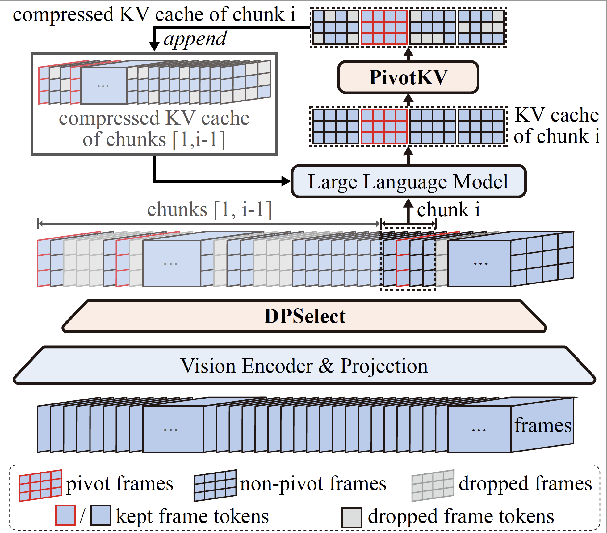

# [ReTaKe: Reducing Temporal and Knowledge Redundancy for Long Video Understanding](https://arxiv.org/abs/2412.20504)

ReTaKe is a novel approach for long video understanding that reduces temporal and knowledge redundancy, enabling MLLMs to process 8x longer video sequences (up to 2048 frames) under the same memory budget.

---

## 📢 Recent Updates
- **2025/03/11**: Polish the paper, improve the readability of the methods section, and add more ablation studies and results for LongVideoBench.
- **2025/02/01**: Support for the latest version of Transformers (v4.48).
- **2025/01/29**: Added support for LLaVA-Video and LLaVA-OneVision.

---

## 🚀 Key Contributions

- **Training-Free Framework**: ReTaKe is the first method to jointly model temporal and knowledge redundancy for long video understanding, reducing the model sequence length to 1/4 of the original with a relative performance loss within 1%.

- **Novel Techniques**:
  - **DPSelect**: A keyframe selection method to reduce low-level temporal redundancy.
  - **PivotKV**: A KV cache compression method to reduce high-level knowledge redundancy in long videos.

<p align="center">
  
</p>

---

## ⚙️ Environment Setup

### For GPU Users:
```bash
conda env create -f environment.yaml
```

### For NPU Users:
```bash
conda env create -f environment_npu.yaml
```

### Additional Dependencies:
```bash
apt-get install ffmpeg  # Required for full functionality; quick demo does not require ffmpeg.
```

---

## 🖥️ Quick Demo

### Step 1: Update Configuration
Modify the `hf_qwen2vl7b_path` in `./demo.py` to point to your local path for `Qwen2-VL-7B-Instruct`.  
For NPU users, also update `config_path` to `'configs/retake_demo_npu.yaml'`.

### Step 2 (Optional for LLaVA-Video): Convert Model
```bash
# Convert LLaVA-Video model into Hugging Face format
# Ensure the following models are downloaded: Qwen2-7B-Instruct, siglip-so400m-patch14-384, and LLaVAVideoQwen2_7B.
python scripts/utils/convert_llava_video_weights_to_hf.py \
  --text_model_id /path_to/Qwen2-7B-Instruct \
  --vision_model_id /path_to/siglip-so400m-patch14-384 \
  --output_hub_path /path_to/llava-video-qwen2-7b-hf \
  --old_state_dict_id /path_to/LLaVAVideoQwen2_7B
```

### Step 3: Run the Demo
```bash
python demo.py
```

---

## 📊 Reproducing ReTaKe Results

### Step 1: Prepare Datasets
Follow the documentation to prepare the required datasets:
- [VideoMME](docs/prepare_videomme.md)
- [MLVU](docs/prepare_mlvu.md)
- [LVBench](docs/prepare_lvbench.md)

### Step 2: Run Inference and Evaluation
Use the provided script to perform inference and evaluation:
```bash
bash scripts/infer_eval_retake.sh ${YOUR_PATH_TO_Qwen2-VL-7B-Instruct} configs/qwen2_vl/retake_qwen2-vl_videomme.yaml 8
bash scripts/infer_eval_retake.sh ${YOUR_PATH_TO_Qwen2-VL-7B-Instruct} configs/qwen2_vl/retake_qwen2-vl_mlvu.yaml 8
bash scripts/infer_eval_retake.sh ${YOUR_PATH_TO_Qwen2-VL-7B-Instruct} configs/qwen2_vl/retake_qwen2-vl_lvbench.yaml 8
```

- Results will be saved in the `./results` directory.

---

## 📚 Citation
If you find this work helpful, please consider citing:
```bibtex
@misc{xiao_retake_2024,
  author       = {Xiao Wang and
                  Qingyi Si and
                  Jianlong Wu and
                  Shiyu Zhu and
                  Li Cao and
                  Liqiang Nie},
  title        = {{ReTaKe}: {Reducing} {Temporal} and {Knowledge} {Redundancy} for {Long} {Video} {Understanding}},
  year         = {2024},
  note = {arXiv:2412.20504 [cs]}
}
```
